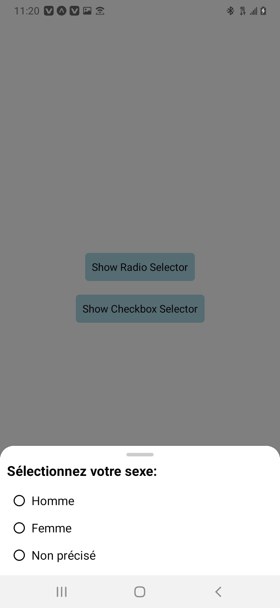
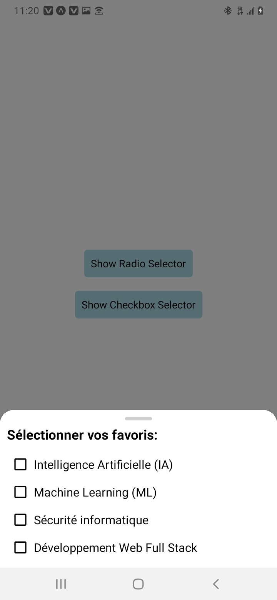

# ReactNative-BottomSheet-Example

## Table des Matières

- [ReactNative-BottomSheet-Example](#reactnative-bottomsheet-example)
  - [Table des Matières](#table-des-matières)
  - [Introduction](#introduction)
  - [Captures d'écran](#captures-décran)
  - [Getting Started](#getting-started)
    - [Installation](#installation)
    - [Usage](#usage)
  - [Références](#références)
  - [Contact](#contact)

## Introduction

Bienvenue dans mon projet React Native, une expérience immersive développée avec Expo et alimentée par TypeScript ! Plongez-vous dans la magie du développement mobile en explorant mon exemple de 'bottom-sheet' élégant, conçu pour rendre vos sélections plus intuitives et agréables.

Que vous soyez un développeur chevronné ou que vous découvriez le monde captivant de React Native, mon projet vous guide à travers la mise en œuvre d'un 'bottom-sheet' interactif. Découvrez comment améliorer l'expérience utilisateur en affichant des options sélectionnables de manière visuellement attrayante.

## Captures d'écran


Bottom-sheet avec liste sélectionnable (Bouton radio)


Bottom-sheet avec liste sélectionnable (Case à cocher)

## Getting Started

### Installation

Pour explorer rapidement et exécuter le projet localement, suivez ces étapes :

1. Commencez par installer Node.js sur votre machine. Téléchargez-le depuis [le site officiel de Node.js](https://nodejs.org/).

2. Clonez le projet à l'aide de la commande :
   
   ```bash
   git clone https://github.com/Full-Stack-Ninja/ReactNative-BottomSheet-Example.git
    ```
3. Accédez au répertoire du projet :
   
   ```bash
    cd ReactNative-BottomSheet-Example
    ```
4. npm install

    ```bash
    npm install
    ```
### Usage
    Lancez l'application en utilisant la commande :

    ```bash
    npm start
    ```
## Références
...

## Contact
...
